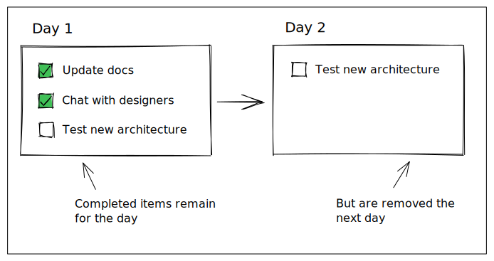

# tododay


## What is tododay?

tododay is designed with the following principles in mind:

- Checking off a todo is satisfying
- Completing a list of todos is satisfying
- Starting each day with a clear plan is productive



## Installation

At the moment this project is compile-from-source only :raised_hands:

For installation instructions, see the "Development" section below

## Architecture

Documentation around the architecture of this application can be found in the [architecture directory](./architecture/)

## Development

Make sure [rust](https://www.rust-lang.org/) and [cargo](https://doc.rust-lang.org/cargo/) are installed - ([installation guide](https://doc.rust-lang.org/cargo/getting-started/installation.html))

Using [cargo](https://doc.rust-lang.org/cargo/), install the [tauri cli](https://crates.io/crates/tauri-cli)

```bash
cargo install tauri-cli
```

To run the development server (includes hot reloading on file changes):

```bash
cargo tauri dev
```

To package and install the application:

```bash
cargo tauri build
```

### Offline SQLx and the database

This project uses [SQLx](https://crates.io/crates/sqlx) to interact with the SQLite database powering the backend. If any changes are made to the prepared SQL queries in this project, the [offline SQLx file](./src-tauri/sqlx-data.json) must also be updated (to allow for compile-time checks).

**Generating a new offline sqlx file**

Make sure that the [SQLx-cli](https://crates.io/crates/sqlx-cli) is installed, with the `sqlite` feature added:

```bash
# supports all databases supported by SQLx
cargo install sqlx-cli

# only for sqlite
cargo install sqlx-cli --no-default-features --features native-tls,sqlite
```

Change the current directory to `src-tauri`:

```bash
cd src-tauri
```

Run SQLx's "prepare" method, passing your database URL:

```bash
cargo sqlx prepare --database-url sqlite:///Users/your_name/Library/Application\ Support/com.tododay.dev/tododay.db
```

This example is macOS specific, for your Linux / Windows paths, check the [tauri documentation](https://tauri.app/v1/api/js/path/#datadir)

Note: "prepare" requires a database to exist, so tododay must have been run at least once (to generate a DB)
