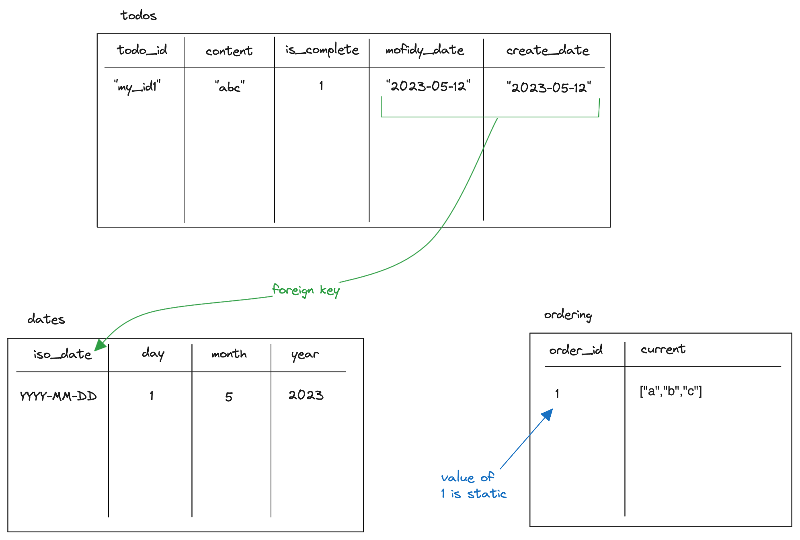

# SQLite database

This project uses a [SQLite](https://sqlite.org/index.html) database to store todos and user-defined ordering. SQLite is a good fit for this application because:

- Local, and can easily be created on first run if it doesn't exist
- Supports migrations for future changes without user-intervention
- Relational, simplifying some logic around dates

## Schema

There are three tables:

- todos
- dates
- ordering

The `ordering` table is special as it's designed to just hold one entry - so the order_id of `1` (integer) is static, and should not change.

